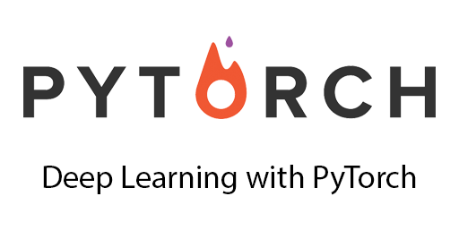

# Deep-Learning-with-PyTorch

 

## Tutorials
- [Tensor](https://github.com/quangddt/Deep-Learning-with-PyTorch/blob/master/tensor_tutorial.ipynb)
  + Tensor is a replacement for Numpy in a sense that what you can do on Numpy arrays, you can do the same thing on Tensor.
  + One can easily convert between Tensor and Numpy.
  + Tensor accelates computing on GPU.
  
- [Autograd: automatic differentiation](https://github.com/quangddt/Deep-Learning-with-PyTorch/blob/master/autograd_tutorial.ipynb):
  + Class Variable is a wrap over Tensor that supports all operations defined on it.
  + A variable x is called a leaf if it is created by the user.
  + Three important attributes of a variable y are: its value, its gradient, and the function that creates y (if y is not a leaf).
  + Calling method y.backward() will compute the gradient of y w.r.t all leaf variables that used to compute y.
  
- [Neural Networks](https://github.com/quangddt/Deep-Learning-with-PyTorch/blob/master/neural_networks_tutorial.ipynb)
  + Construct neural networks using torch.nn package
  + Define the network architecture, forward pass, loss function, and optimizer. The backward pass is automatically computed.
  
- [Trainnig a CNN classifier](https://github.com/quangddt/Deep-Learning-with-PyTorch/blob/master/cifar10_tutorial.ipynb)
  + Use built in dataloader to load data into an iterator that generates mini-batchs at each epoch.
  + Use GPU simply by converting network parameters and input data into cuda data types.
